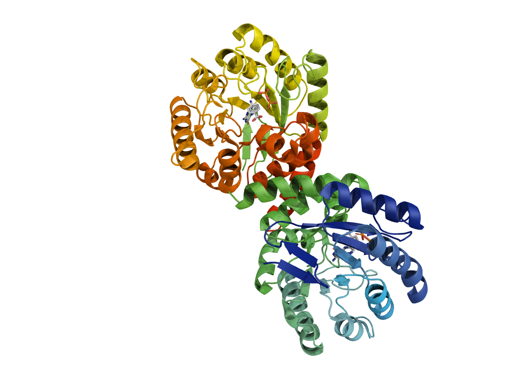
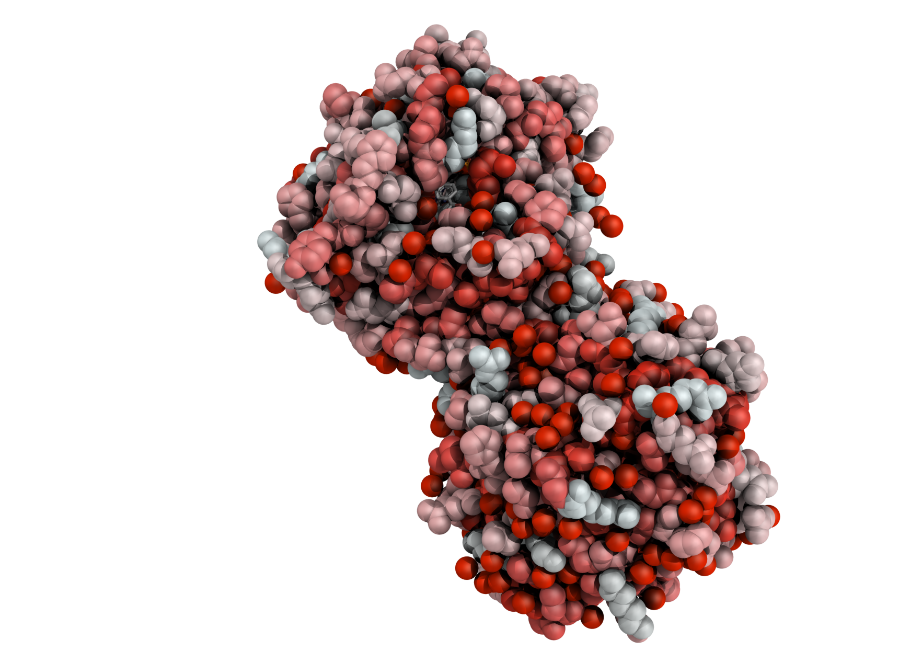

# Custom pymolrc

This changes some default parameters about the stock pymol.
The aim is to generate high quality shading images from a raytrace.

## Install

  1. Download files (for example: `git clone https://github.com/JamesABaker/pymolrc_custom.git`)
  2. Open a terminal
  3. Navigate to `pymolrc_custom` in the terminal
      * For example `cd ~/Downloads/pymolrc_custom`
  4. Run `bash setup.sh` and press enter
  5. Open your pymol environment.
  6. With a molecule, in pymol type `ray` and press enter

## Example output:
A cartoon example render of 3tyz with colours showing N to C position through a rainbow...

A spherical example render of 3tyz with colours showing hydrophobicity...

